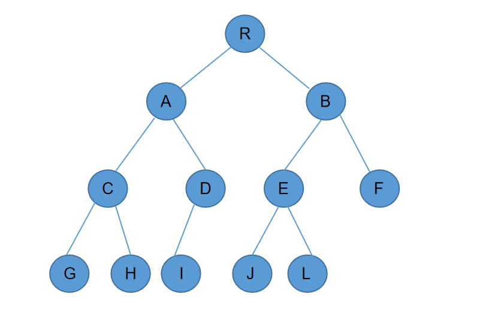
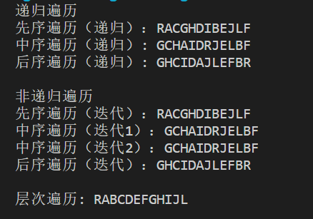
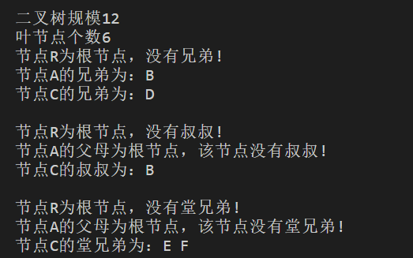

# Lab2 - BinaryTree Report
##### 2021201709 李俊霖
## 非递归后序遍历的实现
**基本思路：**
+ 借助一个辅助栈存储节点。
+ 根节点首先入栈。
+ 在栈非空的情况下，如果栈顶元素不是当前访问元素的父节点，则进入`gotoHLVFL`函数深入寻找子树中最靠左的叶子节点。否则弹出栈顶，该元素即可被后序遍历当前访问。
+ `gotoHLVFL`函数中的入栈顺序为：父节点、右孩子、左孩子。则出栈是的顺序正好反过来，左孩子、右孩子、父节点，符合后序遍历的顺序。

**代码实现如下：**
```c
//后序遍历（非递归）
template <typename T>                           //在以S栈顶节点为根的子树中，找到最高左侧可见叶节点
static void gotoHLVFL(stack<BinNodePosi(T)> &S) //沿途所遇节点依次入栈
{
    while (BinNodePosi(T) x = S.top()) //自顶而下，反复检查当前节点（即栈顶）
        if (HasLChild(*x))             //尽可能向左
        {
            if (HasRChild(*x))
                S.push(x->rc); //若有右孩子，优先入栈
            S.push(x->lc);     //然后才转至左孩子
        }
        else               //实不得已
            S.push(x->rc); //才向右
    S.pop();               //返回之前，弹出栈顶的空节点
}
```
```c
template <typename T, typename VST>
void travPost_I(BinNodePosi(T) x, VST &visit)
{
    stack<BinNodePosi(T)> S; //辅助栈
    if (x)
        S.push(x); //根节点入栈
    while (!S.empty())
    {
        if (S.top() != x->parent) //若栈顶非当前节点之父（则必为其右兄），此时需
            gotoHLVFL(S);         //在以其右兄为根之子树中，找到HLVFL（相当于递归深入其中）
        x = S.top();
        S.pop();
        visit(x->data); //弹出栈顶（即前一节点之后继），并访问之
    }
}
```
## 基本术语功能实现
### 叶结点计数
**基本思路：**
+ 如果该节点没有孩子节点，则该节点为叶子节点。
+ 定义`IsLeaf(x)`函数来实现叶子节点判断。
+ 从根节点递归寻找叶子节点，找到即将计数器加1。

**代码实现如下：**
```c
#define IsLeaf(x) (!HasChild(x))
```
```c 
//叶子节点个数
int count_leaf_number(BinNode<char> *node)
{
    int sum = 0;
    if (IsLeaf(*node)) sum++;
    if (node->lc) sum += count_leaf_number(node->lc);
    if (node->rc) sum += count_leaf_number(node->rc);
    return sum;
}
```

### 寻找兄弟节点
**基本思路：**
+ 寻找该节点父节点的另一个孩子。
+ 使用`IsRoot(x)`函数判断是否为根节点，使用`sibling(p)`函数来寻找兄弟节点。
+ 对根节点特判，因为根节点必然没有兄弟节点。

**代码实现如下：**
```c
#define IsRoot(x) (!((x).parent))//判断是否为根节点
#define sibling(p) /*兄弟*/ \
    (IsLChild(*(p)) ? (p)->parent->rc : (p)->parent->lc)

```
```c
void get_sibling(BinNode<char> *node)
{
    //根节点无兄弟
    if (IsRoot(*node))
    {
        cout << "节点" << node->data << "为根节点，没有兄弟!" << endl;
        return;
    }

    if (sibling(node) != NULL)
        cout << "节点" << node->data << "的兄弟为：" << sibling(node)->data << endl;
}
```
### 寻找堂兄弟节点
+ 基本思路：寻找该节点的叔叔节点的所有孩子节点。其中叔叔节点为该节点的父节点的父节点的其他孩子节点。
+ 使用`HasChild(x)`函数判断该节点是否有孩子节点，使用`uncle(x)`函数来寻找叔叔节点。
+ 对根节点和根节点的孩子节点特判，因为他们必然没有叔叔节点，也不可能有堂兄弟。
```c
#define HasChild(x) (HasLChild(x) || HasRChild(x))     //至少拥有一个孩子
#define uncle(x) /*叔叔*/ \
    (IsLChild(*((x)->parent)) ? (x)->parent->parent->rc : (x)->parent->parent->lc)

```
```c
void get_cousin(BinNode<char> *node)
{
    if (IsRoot(*node)) return;
    if (IsRoot(*(node->parent)))return;
    if (uncle(node) != NULL)
    {
        if (HasChild(*uncle(node)))
        {
            if (uncle(node)->lc->data)
                cout << uncle(node)->lc->data << " ";
            if (uncle(node)->rc->data)
                cout << uncle(node)->rc->data << " ";
        }
        else
            cout << "节点" << node->data << "没有堂兄弟!" ;
    }
}
```
## 运行结果展示
+ 首先在程序中构建一棵树如下所示。
  + 构建方法 
  ```c
    tree.insertAsRoot('R');

    tree.root()->insertAsLC('A');
    tree.root()->insertAsRC('B');

    tree.root()->lc->insertAsLC('C');
    tree.root()->lc->insertAsRC('D');
    tree.root()->rc->insertAsLC('E');
    tree.root()->rc->insertAsRC('F');

    tree.root()->lc->lc->insertAsLC('G');
    tree.root()->lc->lc->insertAsRC('H');
    tree.root()->lc->rc->insertAsLC('I');
    tree.root()->rc->lc->insertAsLC('J');
    tree.root()->rc->lc->insertAsRC('L');
  ```
  + 二叉树图示
  
+ 各类遍历的输出结果。
  
+ 叶节点、兄弟节点、叔叔节点、堂兄弟节点的输出结果。
  