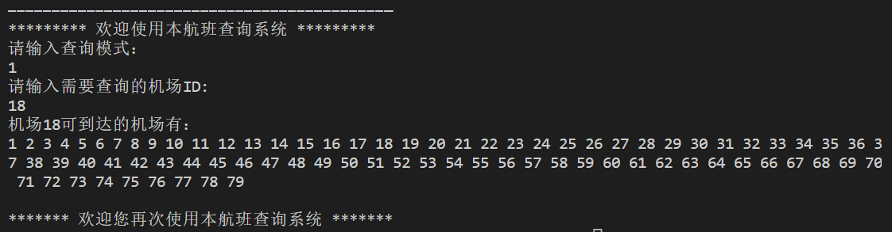
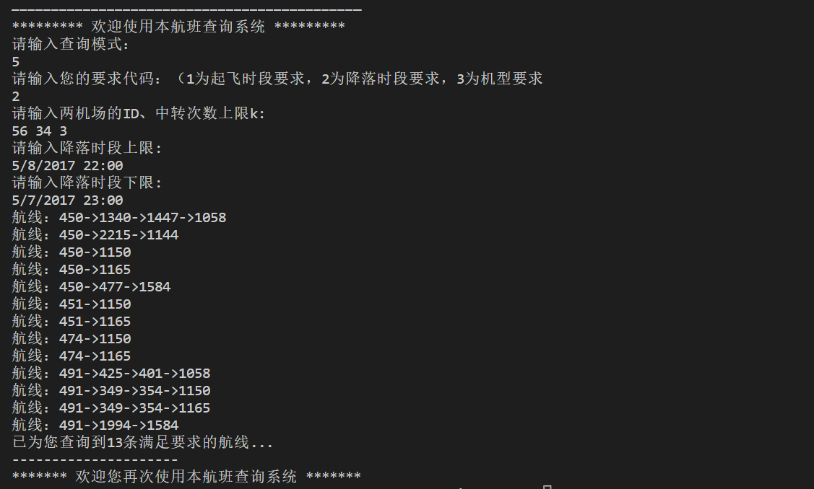

# Lab3 - Airline Report
##### 2021201709 李俊霖
## 1. 已实现功能汇总。
### 1.1. 任意机场的遍历查询。
不考虑时序关系情况下，任意机场出发的遍历，包括深度优先遍历和广度优先遍历。
### 1.2. 给定中转次数的任意机场可连通性查询。
不考虑时序关系情况下，任意两个机场的可连通性查询，包括是否可以直飞、1次中转、2次中转等等。
### 1.3. 机场航线数目查询。
考虑时序关系，直飞或1次中转情况下，任意两个机场的航线数目查询。
### 1.4. 机场间最短飞行时间查询。
考虑时序关系，包含转机停留时间，任意两个机场之间的最短飞行时间查询。
### 1.5. 特定要求下的航线查询。
考虑时序关系，给定起飞时段/降落时段/机型要求，任意两个机场中转次数不超过K的**尽可能多**的航线查询。
### 1.6. 特定要求下的最低费用航线查询。
考虑时序关系，给定起飞时段/降落时段/机型要求，任意两个机场之间最低费用及其对应的航线路径查询。
### 1.7. 有中转时间限制的航线查询。
考虑时序关系，给定中转时间上限（包括**单次中转时间上限**或**总中转时间上限**）且中转次数不超过k，两机场间**尽可能多**的备选航线查询。
### 1.8. 有中转时间限制的最低费用航线查询。
考虑时序关系，给定中转时间上限（包括**单次中转时间上限**或**总中转时间上限**），任意两个机场之间最低费用及其对应的航线路径查询。

## 2. 具体实现方式与测试样例。
### 2.1. 任意机场的遍历查询。
+ **实现方式：** 建立用邻接表，所有机场为邻接表的顶点，所有机场间航线为边。
  + bfs：从一个机场开始，取队头节点出队开始扩展，将所有其可达的机场入队，直到队列为空，即得到所有机场的遍历搜索。
  + dfs：从一个机场开始，递归搜索下一个可达的机场，直到在该路径上的所有机场均被标记，即得到该机场到所有机场的遍历搜索。
+ **测试样例：**
  
  

### 2.2. 给定中转次数的任意机场可连通性查询。
+ **实现方式：** 建立二维邻接矩阵（二维数组），以0/1表示每个机场的连通性。使用深度优先搜索的算法，对步数加以限制（步数等于中转次数加1），可以搜索到任意点出发给定中转次数的可连通性01矩阵。
+ **测试样例：** 该矩阵规模较大，在本实验报告中略去。

### 2.3. 机场航线数目查询。
+ **实现方式：** 沿用上一问的二维邻接矩阵，在矩阵中以次数存储航线的条数，0即为不连通。对于0次中转，直接获取对应位置的航线值。对于一次中转，使用深度优先搜索的算法或者两个循环的枚举，对前后航班的时序加以限制（后一班航班的起飞时间大于前一班的降落时间），可以得到相应的航线条数。
+ **测试样例1：** 
   
  
+ **测试样例2：** 
  

### 2.4. 机场间最短飞行时间查询。
+ **实现方式：**
  + 首先建图，将所有航班视为顶点建立邻接表，每个顶点可到达的边为该航班可以转接的后续航班。
  + 使用dijkstra算法。将每趟航班的到达时间视为到起始点的距离，并压进优先队列进行优化。当优先队列非空时，取出时间最小的点，遍历该航班的所有后续可达航班，如果该航班未访问且到达时间比之前到达该航班的时间更短，则更新并入队。
  + 找出起始机场可出发的所有航班，对每趟航班使用一次dijkstra算法；再找到目的机场可到达的航班的用时中最小的值。
+ **测试样例1：** 
   
  
+ **测试样例2：** 
  

### 2.5. 特定要求下的航线查询。
#### 2.5.1. 起飞时段要求
+ **实现方式：** 
  + 建图方式和dijkstra算法同2.4。
  + 不同的是：
    + 在搜索起始机场可出发的所有航班时，加入对航班起飞时间的限制。
    + 将每趟航班的**中转次数**视为dijkstra算法中到起始点的距离，并用优先队列进行优化。
    + 中转次数大于k时不可入队。（剪枝）
+ **测试样例：** 
  

#### 2.5.2. 降落时段要求
+ **实现方式：**
  + 建图方式和dijkstra算法同2.4。
  + 不同的是：
    + 在搜索降落机场可到达的所有航班时，加入对航班降落时间的限制。
    + 将每趟航班的**中转次数**视为dijkstra算法中到起始点的距离，并用优先队列进行优化。
    + 中转次数大于k时不可入队。（剪枝）
+ **测试样例：**
   

#### 2.5.3. 机型要求
+ **实现方式：**
  + 建图方式和dijkstra算法同2.4。
  + 不同的是：
    + 在搜索起始机场可出发的所有航班和降落机场可到达的所有航班时，加入对航班机型的限制。
    + 将每趟航班的**中转次数**视为dijkstra算法中到起始点的距离，并用优先队列进行优化。
    + dijkstra入队条件有机型限制。
    + 中转次数大于k时不可入队。（剪枝）
+ **测试样例：** 
  

### 2.6. 特定要求下的最低费用航线查询。
#### 2.6.1. 起飞时段要求
+ **实现方式：**
  + 建图方式和dijkstra算法同2.4。
  + 不同的是：
    + 在搜索起始机场可出发的所有航班时，加入对航班起飞时间的限制。
    + 将每趟航班的**费用之和**视为dijkstra算法中到起始点的距离，并用优先队列进行优化。
+ **测试样例：** 
  

#### 2.6.2. 降落时段要求
+ **实现方式：**
  + 建图方式和dijkstra算法同2.4。
  + 不同的是：
    + 在搜索降落机场可到达的所有航班时，加入对航班降落时间的限制。
    + 将每趟航班的**费用之和**视为dijkstra算法中到起始点的距离，并用优先队列进行优化。
+ **测试样例：** 
  

#### 2.6.3. 机型要求
+ **实现方式：**
  + 建图方式和dijkstra算法同2.4。
  + 不同的是：
    + 在搜索起始机场可出发的所有航班和降落机场可到达的所有航班时，加入对航班机型的限制。
    + 将每趟航班的**费用之和**视为dijkstra算法中到起始点的距离，并用优先队列进行优化。
    + dijkstra入队条件有机型限制。
+ **测试样例：** 
  

### 2.7. 有中转时间限制的航线查询。
#### 2.7.1 单次中转时间上限
+ **实现方式：**
  + 建图方式和dijkstra算法同2.4。
  + 不同的是：
    + 在搜索起始机场可出发的所有航班和降落机场可到达的所有航班时，加入对航班机型的限制。
    + 将每趟航班的**中转次数**视为dijkstra算法中到起始点的距离，并用优先队列进行优化。
    + dijkstra入队条件有机型限制；中转次数大于k时不可入队。
    + **单次中转时间大于单次中转时间上限的后续航班不入队（剪枝）**。
+ **测试样例：**
  
  

#### 2.7.1 总中转时间上限
+ **实现方式：**
  + 开一个全局数组记录到该航班时的总中转时间，**总中转时间大于单次中转时间上限的后续航班不入队（剪枝）**。
  + 其余同2.7.1。
+ **测试样例：**
  

### 2.8. 有中转时间限制的最低费用航线查询。
#### 2.8.1 单次中转时间上限
+ **实现方式：**
  + 建图方式和dijkstra算法同2.4。
  + 不同的是：
    + 将每趟航班的**费用之和**视为dijkstra算法中到起始点的距离，并用优先队列进行优化。
    + **单次中转时间大于单次中转时间上限的后续航班不入队（剪枝）**。
+ **测试样例：**
  
  
#### 2.8.1 总中转时间上限
+ **实现方式：**
  + 开一个全局数组记录到该航班时的总中转时间，**总中转时间大于单次中转时间上限的后续航班不入队（剪枝）**。
  + 其余同2.8.1。
+ **测试样例1：**
  
+ **测试样例2：**
  

## 3. 复杂度分析
设$n$为图的顶点数，$e$为边数。
### 3.1 算法的复杂度

+ **广度优先搜索：**
  + 空间复杂度：最坏情况下每个顶点都需入队，空间复杂度为$O（n）$。
  + 时间复杂度：
    + 邻接表存储，对于每个顶点都需搜索一次，时间复杂度$O（n）$，从一个顶点开始搜索时，开始搜索，访问未被访问过的节点。在最坏的情况下，每个顶点和每条边都至少访问1次，因为在搜索过程中，如果子节点被搜索过不会入队，时间复杂度为$O(e)$，算法总的时间复度为$O(n+e)$。
    + 邻接矩阵存储，对于每个顶点的邻接点的搜索时间复杂度为$O(n)$。对于该节点所在的行有n个顶点，总时间复杂度为$O(n^{2})$。
+ **深度优先搜索：**
  + 空间复杂度：借助递归工作栈，最坏情况下每个顶点都需入栈，空间复杂度为$O（n）$。
  + 时间复杂度：
    + 邻接表存储，查找每一个顶点的邻接点时间复杂度$O（n）$，访问每一条边时间复杂度为$O(e)$，算法总的时间复度为$O(n+e)$。
    + 邻接矩阵存储，查找每一个顶点的邻接点时间复杂度$O（n）$，对于邻接矩阵上每一个点都需要搜索，总时间复杂度为$O(n^{2})$。
+ **dijkstra算法：**
  + 基本思路：
    + 所有点分为两个集合S和T，S最开始只包括源点s。S集合表示已经计算出最短路径的点集合，T表示尚未计算出最短路径的点集合。
    + 每次从集合T中选出一个与集合S距离最短的点v，将点v加入集合S。通过点v对集合T中的点进行松弛操作，更新T中点的最短距离。不断重复此步骤2，直至T集合中无法找出与集合S相邻的点。
  + 优先队列实现思路：
    + 初始化：初始化距离数组d，起点设为0，其他点设为无穷大；初始化优先队列Q：对所有顶点v,将 $(d[v],v)$压进Q中；初始化$visitedv$数组为空集
    + 从Q中弹出距离最小的顶点u，加入$visited$，遍历u的所有未在$visitedv$中的邻居w，判断$d[u]+l(u,w)<d[w]$是否成立;如果成立，更新$d[w]=d[u]+l(u,w)$，并将$(d[w],w)$ 压进优先队列Q，否则剪枝。
    + 回到3循环，直到优先队列Q为空。

  + 时间复杂度：外层循环$O(n)$，内层循环 （遍历所有邻居）为$O(v)$，更新邻居为$O(log(n))$。总复杂度为$O(nvlogn)$ ，即$O(elogn)）$。

### 3.2 数据结构的空间复杂度
+ **邻接表：**$O(n+e)$
+ **邻接矩阵：**$O(n^{2})$

## 4. 总结与思考。
### 4.1 本系统的优点
+ 作为一个用户友好型查询系统，与用户交互信息完整详尽，尽可能提高详细的查询结果和报错信息，使用户可以更便捷地进行查询使用。
+ 在算力允许的情况下给出多种方案，供用户参考。如在功能5和7中，在满足用户时间、机型等要求的前提下，尽可能多地提供更优异边界的航线信息，供用户选择。
+ 算法复杂度符合要求，在查询信息完整、输入合法的前提下，基本可以做到迅速查询到相应符合要求的航班信息。
### 4.2 本系统的缺点
+ 工程性有待加强，由于开始工程设计的缺陷和开发者水平有限，实现过程中冗余代码较多。
+ 算法时间空间复杂度不是最优，若需要基于更大数据量的查询，可能需要提升算法的效率。
+ 可能出现的bug。
### 4.3 收获
+ 这是作者目前为止独立完成的较为复杂的小项目之一，完整写完小项目之后，作者对工程项目的编排、代码的接口设计、代码的复用有了更深的认识和实践经验。
+ 在设计代码布局和不断调错的过程中，作者码力大大提高。
+ 对图的构建，bfs、dfs、dijkstra算法有了更全面深入的认识，可以较好第应用这些算法解决基本的图论和搜索问题。

## 5. 参考资料。
+ [基于优先队列的Dijkstra算法](https://blog.csdn.net/weixin_38442390/article/details/109096381?ops_request_misc=%257B%2522request%255Fid%2522%253A%2522166824113516782425156827%2522%252C%2522scm%2522%253A%252220140713.130102334..%2522%257D&request_id=166824113516782425156827&biz_id=0&utm_medium=distribute.pc_search_result.none-task-blog-2~all~sobaiduend~default-1-109096381-null-null.142^v63^control,201^v3^control_2,213^v2^t3_esquery_v3&utm_term=%E4%BC%98%E5%85%88%E9%98%9F%E5%88%97dijkstra&spm=1018.2226.3001.4187)
+ [Dijkstra实现（邻接表C++版）](https://blog.csdn.net/ahundredmile/article/details/125881718?ops_request_misc=%257B%2522request%255Fid%2522%253A%2522166913052316782395357858%2522%252C%2522scm%2522%253A%252220140713.130102334..%2522%257D&request_id=166913052316782395357858&biz_id=0&utm_medium=distribute.pc_search_result.none-task-blog-2~all~baidu_landing_v2~default-4-125881718-null-null.142^v66^control,201^v3^add_ask,213^v2^t3_esquery_v3&utm_term=%E9%82%BB%E6%8E%A5%E8%A1%A8Dijkstra&spm=1018.2226.3001.4187)
+ [Dijkstra算法的两种写法和时间复杂度计算](https://blog.csdn.net/tabris919/article/details/108212479?ops_request_misc=&request_id=&biz_id=102&utm_term=dijkstra%E6%97%B6%E9%97%B4%E5%A4%8D%E6%9D%82%E5%BA%A6&utm_medium=distribute.pc_search_result.none-task-blog-2~all~sobaiduweb~default-2-108212479.142^v66^control,201^v3^control_2,213^v2^t3_control1&spm=1018.2226.3001.4187)
+ 《数据结构(c++语言版)》邓俊辉编著-清华大学出版社