# Lab1-Calculator-Report
##### 李俊霖 2021201709
### 已实现的基本功能
   + 向量和栈的基本操作。
   + 任意一元多项式的运算，包括加法、减法、乘法、微分(任意阶)、积分(任意阶)。**输出符合常规表示，可省略系数为零的项**
等。
   + 自行实现的矩阵运算，加、减、乘、转置、**行列式**。
   + 四则表达式求值。操作符包括加、减、乘、除、幂、括号，对任意浮点数都成立，其中**乘方支持正负数和小数**。
   + 单变量的表达式求值，满足C/C++语言的变量命名要求的情况下可以自动识别。
   + 定义并运行单变量多项式函数，保留函数历史，**支持运行历史函数**，且同名多次定义可覆盖。
### 实现的非法输入甄别
   + 四则表达式求值：
     + 括号不匹配。
     + 输入了变量。
     + 其他错误的符号不合法输入，如`3++5`、`（+9-5）`、`6+(×7-4)`、`6+`等等。
   + 单变量表达式求值：
     + 输入多变量或无变量。
     + 没有变量。
     + 表达式不合法（非法情况与四则表达式求值相同）
   + 单变量函数求值
     + 未定义函数直接求值。
     + 输入多变量或无变量。
     + 表达式不合法（非法情况与四则表达式求值相同）
     + 另外，定义同名的函数合法，后定义者覆盖先定义者。
   + 矩阵运算：
     + 矩阵阶数与输入的不符。
     + 矩阵相乘阶数不匹配无法运算。
   + 一元多项式运算
     + 次数与系数的个数不匹配（多项式不合法）

### 基本功能的实现

#### 四则表达式求值
+ 表达式检查与求值
```c
//表达式检查和求值
int flag = 1;
int len = str.length();
char c[len + 2];
for (int i = 0; i < sizeof(c); i++)
{
    c[i] = str[i];
}
//检查括号配对:0不合法，1合法
flag = check_paren(c, 0, len);
//负号预处理
tran_nagative_sign(str);
// cout << str << endl;

flag = check_symbol(str);

if (flag == 0)
{
    cout << "Illegal input!!" << endl;
}
else
{
    cout << "Answer:" << cal_arithmetic(to_postfix(str)) << endl;
}
```
+ 中缀表达式转后缀表达式
```c
//中缀表达式 转 后缀表达式
string to_postfix(string str)
{
    // cout << 22222 << endl;
    Stack<string> num_stack, operator_stack;
    // cout << 3 << endl;
    int len = str.length();
    int pos = 0;

    while (pos < len)
    {
        if (isdigit(str[pos]))
        {
            double op = get_op(str, pos);
            num_stack.push(to_string(op)); // to_string:将数字常量转换为字符串
        }
        else if (str[pos] == ' ')
            pos++;
        else
        {
            char ch = str[pos++];
            if (ch == '+')
            {
                while (!operator_stack.empty() && operator_stack.top() == "^")
                    num_stack.push(operator_stack.top()), operator_stack.pop();
                while (!operator_stack.empty() && (operator_stack.top() == "*" || operator_stack.top() == "/"))
                    num_stack.push(operator_stack.top()), operator_stack.pop();
                while (!operator_stack.empty() && (operator_stack.top() == "+" || operator_stack.top() == "-"))
                    num_stack.push(operator_stack.top()), operator_stack.pop();
                operator_stack.push("+");
            }
            else if (ch == '-')
            {
                while (!operator_stack.empty() && operator_stack.top() == "^")
                    num_stack.push(operator_stack.top()), operator_stack.pop();
                while (!operator_stack.empty() && (operator_stack.top() == "*" || operator_stack.top() == "/"))
                    num_stack.push(operator_stack.top()), operator_stack.pop();
                while (!operator_stack.empty() && (operator_stack.top() == "+" || operator_stack.top() == "-"))
                    num_stack.push(operator_stack.top()), operator_stack.pop();
                operator_stack.push("-");
            }
            else if (ch == '*')
            {
                while (!operator_stack.empty() && operator_stack.top() == "^")
                    num_stack.push(operator_stack.top()), operator_stack.pop();
                while (!operator_stack.empty() && (operator_stack.top() == "*" || operator_stack.top() == "/"))
                    num_stack.push(operator_stack.top()), operator_stack.pop();
                operator_stack.push("*");
            }
            else if (ch == '/')
            {
                while (!operator_stack.empty() && operator_stack.top() == "^")
                    num_stack.push(operator_stack.top()), operator_stack.pop();
                while (!operator_stack.empty() && (operator_stack.top() == "*" || operator_stack.top() == "/"))
                    num_stack.push(operator_stack.top()), operator_stack.pop();
                operator_stack.push("/");
            }
            else if (ch == '^')
            {
                while (!operator_stack.empty() && operator_stack.top() == "^")
                    num_stack.push(operator_stack.top()), operator_stack.pop();
                operator_stack.push("^");
            }
            else if (ch == '(')
                operator_stack.push("(");
            else
            {
                while (operator_stack.top() != "(")
                {
                    num_stack.push(operator_stack.top());
                    operator_stack.pop();
                }
                operator_stack.pop();
            }
        }
    }
    while (!operator_stack.empty())
    {
        num_stack.push(operator_stack.top());
        operator_stack.pop();
    }

    string ans = "";
    while (!num_stack.empty())
        ans = num_stack.top() + " " + ans, num_stack.pop();

    return ans;
}
```
+ 后缀表达式求值
```c
double cal_arithmetic(string str)
{
    int len = str.length();
    int pos = 0;
    char c;
    Stack<double> num_stack;

    //遍历
    while (pos < len)
    {
        if (isdigit(str[pos]))
        {
            double op = get_op(str, pos);
            num_stack.push(op);
        }
        else if (str[pos] == ' ')
            pos++;
        else
        {
            double num1, num2;
            c = str[pos++];
            num2 = num_stack.top();
            num_stack.pop();
            num1 = num_stack.top();
            num_stack.pop();

            switch (c)
            {
            case '+':
                num_stack.push(num1 + num2);
                break;
            case '-':
                num_stack.push(num1 - num2);
                break;
            case '*':
                num_stack.push(num1 * num2);
                break;
            case '/':
                num_stack.push(num1 / num2);
                break;
            case '^':
                num_stack.push(pow(num1, num2));
            }
        }
    }
    double ans = num_stack.top();
    return ans;
}
```

#### 单变量表达式求值
+ 求值基本逻辑
```c
//输入单变量表达式
string fun1;
cout << "please input your function: (example:3+4*X2)" << endl;
getline(cin, fun1);

//输入要求的值
string run1;
double key;
cout << "please input the key:(example:if you want to get x=5, please input: 5)" << endl;
cin >> key;

//在表达式中找到变量
string variable1 = get_variable(fun1);

//没有变量时报错
if (variable1 == "wrongstring")
{
    cout << "Illegal input: no variable!!" << endl;
    continue;
}
cout << "The variable is:" << variable1 << endl;

//把表达式中的变量换成要求的值（代入）
change_str(fun1, variable1, key);

//变量多于一个时报错
string variable2 = get_variable(fun1);
if (variable2 != "wrongstring")
{
    cout << "Illegal input: too many variables!!" << endl;
    continue;
}

//表达式检查和求值————————————————————————
int flag = 1;
int len = fun1.length();
char c[len + 2];
for (int i = 0; i < sizeof(c); i++)
{
    c[i] = fun1[i];
}
//检查括号配对
flag = check_paren(c, 0, len);
//负号预处理
tran_nagative_sign(fun1);
//检查连续出现的符号
flag = check_symbol(fun1);

if (flag == 0) cout << "Illegal input!!" << endl;
else cout << "Answer:" << cal_arithmetic(to_postfix(fun1)) << endl;
```

+ 在表达式中找到变量
```c
//单变量表达式：在表达式中找到变量
string get_variable(string str)
{
    int i = 0;
    int lo = 0;
    int hi = 0;
    int len = str.length();

    str += "  ";

    int flag = 0;
    while (lo < len && flag == 0 && i < len)
    {
        if ((str[i] >= 'a' && str[i] <= 'z') || (str[i] >= 'A' && str[i] <= 'Z') || str[i] == '_')
        {
            lo = i;
            i++;
            while (1)
            {
                if (str[i] == '+' || str[i] == '-' || str[i] == '*' || str[i] == '/' || str[i] == '^' || str[i] == ' ' || str[i] == ')')
                {
                    hi = i;
                    flag = 1;
                    break;
                }
                i++;
            }
        }
        else
            i++;
    }
    string wrong_str = "wrongstring";
    if (flag == 0)
        return wrong_str;
    else
    {
        string var(str, lo, hi - lo);
        return var;
    }
}
```
+ 把表达式中的变量换成要求的值（代入）
```c
//表达式：把表达式中的变量换成要求的值
void change_str(string &str, string var, double key)
{
    int lo = 0;
    int hi = 0;
    int len = var.length();
    int flag = 0;
    string strkey = to_string(key);
    //负号特判
    if (key < 0)
    {
        strkey = '(' + strkey + ')';
    }
    while ((flag = str.find(var, flag)) != string::npos)
    {
        flag = str.find(var);
        if (flag != -1)
        {
            str.replace(flag, len, strkey);
        }
    }
}
```
#### 单变量函数求值
+ 基本逻辑
```c
//输入函数表达式
string op;
cout << "If you want to define a function, please input DEF" << endl;
cout << "If you want to calculate a function, please input RUN" << endl;
cout << "If you want to exit, please input EXIT to exit this mode" << endl;
cout << "CAUTION:If your input is illegal, you will exit this mode with all memory disappeared!" << endl;
getline(cin, op);

//不规范操作输入
if (op != "DEF" && op != "RUN" && op != "EXIT")
{
    cout << "Illegal input!! exit this mode..." << endl;
    continue;
}
//规范操作输入
while (op == "DEF" || op == "RUN" || op == "EXIT")
{
    //定义新函数
    if (op == "DEF")
    {
        num++;
        cout << "please input the function, example: f(X2)=3+4*X2" << endl;
        string fun1;

        //输入函数如 f(X2)=3+4*X2
        getline(cin, fun1);
        function[num].ori_fun = fun1;

        //在表达式中（括号里）找到变量
        string variable = fun_get_variable(fun1);
        function[num].var = variable;
        // cout << "The variable is:" << variable << endl;

        //在表达式中找到函数名
        function[num].name = fun_get_name(fun1);
        cout << "The name is:" << function[num].name << endl;

        //在表达式中找到要求的表达式部分
        function[num].expression = get_function(fun1);
    }
    //运行旧函数
    else if (op == "RUN")
    {
        string run_fun;
        cout << "please input the key:example:f(1)" << endl;
        getline(cin, run_fun);

        //在公式中找到函数名
        string now_name = fun_get_name(run_fun);
        cout << "The name is:" << now_name << endl;

        //在函数记忆中检索该函数名
        //如果函数重名，优先采用后定义的函数！！！！！
        int i;
        for (i = num; i >= 1; i--)
        {
            //检索到了，开始计算
            if (now_name == function[i].name)
            {
                double key = get_key(run_fun);

                //把表达式中的变量换成要求的值（代入）
                function[i].afterchange_exp = const_change_str(function[i].expression, function[i].var, key);
                // cout << "function[i].afterchange_exp: " << function[i].afterchange_exp << endl;

                //表达式检查和求值————————————————————————
                int flag = 1;
                int len = function[i].afterchange_exp.length();
                char c[len + 2];
                for (int j = 0; j < sizeof(c); j++)
                {
                    c[j] = function[i].afterchange_exp[j];
                }
                //检查括号配对
                flag = check_paren(c, 0, len);
                //负号预处理
                tran_nagative_sign(function[i].afterchange_exp);
                //检查连续出现的符号
                flag = check_symbol(function[i].afterchange_exp);

                if (flag == 0) cout << "Illegal input!!" << endl;
                else cout << "Answer:" << cal_arithmetic(to_postfix(function[i].afterchange_exp)) << endl;
                
```


+ 函数中获取要求的值
```c
double get_key(string str)
{
    double key;

    int len = str.length();
    int hi;
    int lo;
    int pos = 0;

    //找左括号
    while (1)
    {
        if (str[pos] == '(')
        {
            lo = pos;
            break;
        }
        else
            pos++;
    }
    //找右括号
    pos = 0;
    while (1)
    {
        if (str[pos] == ')')
        {
            hi = pos;
            break;
        }
        else
            pos++;
    }
    int x = 0;

    string fun(str, lo + 1, hi - lo - 1);
    key = get_op(fun, x);

    return key;
}
```
+ 获取要求的函数表达式
```c
string get_function(string str)
{

    int len = str.length();
    int pos = 0;
    while (pos < len)
    {
        if (str[pos] != '=')
            pos++;
        else
            break;
    }
    while (str[pos + 1] == ' ')
        pos++;
    string fun(str, pos + 1, len - pos - 1);
    return fun;
}
```
+ 把表达式中的变量换成要求的值,不改变原式
```c
string const_change_str(string str, string var, double key)
{
    string change_string(str);
    int lo = 0;
    int hi = 0;
    int len = var.length();
    int flag = 0;
    string strkey = to_string(key);
    while ((flag = change_string.find(var, flag)) != string::npos)
    {
        flag = change_string.find(var);
        if (flag != -1)
        {
            change_string.replace(flag, len, strkey);
        }
    }
    return change_string;
}
```

#### 矩阵运算
+ 矩阵输出
```c
void output_mat(int n, int m)
{
    for (int i = 0; i < n; i++)
    {
        for (int j = 0; j < m; j++)
        {
            cout << ans[i][j] << " ";
        }
        cout << endl;
    }
    int x = ans.size();
    ans.remove(0, x);
}
```
+ 矩阵相加、减
```c
void mat_add(Vector<Vector<double>> mat1, Vector<Vector<double>> mat2, int n, int m)
{
    for (int i = 0; i < n; i++)
    {
        Vector<double> a;
        for (int j = 0; j < m; j++)
        {
            a.insert(mat1[i][j] + mat2[i][j]);
        }
        ans.insert(a);
    }
    return;
}
```
+ 矩阵相乘
```c
void mat_multi(Vector<Vector<double>> mat1, Vector<Vector<double>> mat2, int n1, int m1, int n2, int m2)
{
    double matrix[30][30] = {0};
    for (int i = 0; i < n1; i++)
    {
        for (int j = 0; j < m2; j++)
        {
            for (int k = 0; k < m1; k++)
            {
                matrix[i][j] += mat1[i][k] * mat2[k][j];
            }
        }
        // cout<<endl;
    }
    for (int i = 0; i < n1; i++)
    {
        Vector<double> a;
        for (int j = 0; j < m2; j++)
        {
            a.insert(matrix[i][j]);
        }
        ans.insert(a);
    }
    return;
}
```
+ 矩阵转置
```c
void mat_tran(Vector<Vector<double>> mat, int n1, int m1)
{
    double matrix[30][30] = {0};
    for (int i = 0; i < n1; i++)
    {
        for (int j = 0; j < m1; j++)
        {
            matrix[j][i] = mat[i][j];
        }
        // cout<<endl;
    }
    for (int i = 0; i < m1; i++)
    {
        Vector<double> a;
        for (int j = 0; j < n1; j++)
        {
            a.insert(matrix[i][j]);
        }
        ans.insert(a);
    }
    return;
}
```
+ 计算行列式
```c
double mat_cal_det(int n, Vector<Vector<double>> a)
{
    if (n == 2)
        return a[0][0] * a[1][1] - a[0][1] * a[1][0];
    else
    {
        int sum = 0;
        for (int k = 0; k < n; k++)
        {
            Vector<Vector<double>> b;
            for (int i = 1; i < n; i++)
            {
                Vector<double> c;
                for (int j = 0; j < n; j++)
                {
                    if (j == k)
                        continue;
                    c.insert(a[i][j]);
                }
                b.insert(c);
            }
            if (k % 2 == 0)
            {
                sum += a[0][k] * mat_cal_det(n - 1, b);
            }
            else
                sum -= a[0][k] * mat_cal_det(n - 1, b);
        }
        return sum;
    }
}
```
#### 单变量多项式运算
+ 多项式输出
```c
void output_poly(Vector<double> poly_ans, int times)
{
    int flag = 0;
    cout << "Answer:";
    if (poly_ans[0] != 0)
    {
        cout << poly_ans[0];
        flag = 1;
    }
    for (int i = 1; i <= times; i++)
    {
        if (poly_ans[i] == 0)
            continue;

        else if (poly_ans[i] > 0)
        {
            if (i == 1 && flag == 0)
            {
                if (poly_ans[i] == 1)
                    cout << "x";
                else
                    cout << poly_ans[i] << "x";
                flag = 1;
            }
            else if (i == 1 && flag == 1)
            {
                if (poly_ans[i] == 1)
                    cout << "+x";
                else
                    cout << "+" << poly_ans[i] << "x";
            }
            else if (i != 1 && flag == 0)
            {
                if (poly_ans[i] == 1)
                    cout << "x^" << i;
                else
                    cout << poly_ans[i] << "x^" << i;
                flag = 1;
            }
            else if (i != 1 && flag == 1)
            {
                if (poly_ans[i] == 1)
                    cout << "+x^" << i;
                else
                    cout << "+" << poly_ans[i] << "x^" << i;
            }
        }
        else if (poly_ans[i] < 0)
        {
            if (i == 1)
            {
                if (poly_ans[i] == -1)
                    cout << "-x";
                else
                    cout << poly_ans[i] << "x";
            }
            else
            {
                if (poly_ans[i] == -1)
                    cout << "-x^" << i;
                else
                    cout << poly_ans[i] << "x^" << i;
            }
        }
    }
    if (flag == 0)
        cout << '0';
    cout << endl;
}
```
+ 多项式加减
```c
void poly_plus(Vector<double> &poly1_item, Vector<double> &poly2_item, int t1, int t2)
{
    int times = max(t1, t2);
    Vector<double> poly_ans;

    //加法运算
    for (int i = 0; i <= times; i++)
    {
        poly_ans.insert(poly1_item[i] + poly2_item[i]);
    }
    //多项式输出
    output_poly(poly_ans, times);
}
```
+ 多项式乘法
```c
//多项式乘法
void poly_multi(Vector<double> &poly1_item, Vector<double> &poly2_item, int t1, int t2)
{
    int times = t1 + t2;
    Vector<double> poly_ans;
    double multi[30][30] = {0};
    double ans[100] = {0};
    //乘法运算
    for (int i = 0; i <= t1; i++)
    {
        for (int j = 0; j <= t2; j++)
        {
            multi[i][j] = poly1_item[i] * poly2_item[j];
        }
    }
    ans[0] = multi[0][0];
    for (int k = 1; k <= times; k++)
    {
        for (int i = 0, j = k; j >= 0; i++, j--)
        {
            ans[k] += multi[i][j];
        }
    }
    for (int k = 0; k <= times; k++)
    {
        poly_ans.insert(ans[k]);
    }

    //多项式输出
    output_poly(poly_ans, times);
}
```
+ 多项式微分
```c
void poly_differential(Vector<double> &poly_item, int t)
{
    int times = t - 1;
    double item[50] = {0};
    Vector<double> poly_ans;
    //积分运算
    for (int i = 1; i <= t; i++)
    {
        item[i - 1] = poly_item[i] * i;
        // cout << item[i - 1] << endl;
    }
    for (int i = 0; i <= times; i++)
    {
        poly_ans.insert(item[i]);
    }
    //多项式输出
    output_poly(poly_ans, times);
    return;
}
```
+ 多项式积分
```c
void poly_integral(Vector<double> &poly_item, int t)
{
    int times = t + 1;
    double item[50] = {0};
    Vector<double> poly_ans;
    //积分运算
    for (int i = 0; i <= t; i++)
    {
        item[i + 1] = poly_item[i] / (i + 1);
    }
    poly_ans.insert(0);
    for (int i = 1; i <= times; i++)
    {
        poly_ans.insert(item[i]);
    }
    //多项式输出
    output_poly(poly_ans, times);
    return;
}
```

### 其他实现细节和非法输入甄别
#### 四则表达式求值
+ 对负号的处理。如（-5+3）类似的表达式。
  **思路：找到负号（区别于减号），在该负号前加0，变成（0-5+3）的形式，使表达式运算可以处理。**
```c
//对负号预处理，在负号前面加0
void tran_nagative_sign(string &str)
{
    int len = str.length();
    int pos = 0;
    while (pos < len)
    {
        if (pos == 0 && str[pos] == '-')
        {
            str.insert(pos, 1, '0');
            pos++;
        }
        else if (str[pos] == '-' && str[pos - 1] == '(')
        {
            str.insert(pos, 1, '0');
            pos++;
        }
        else
            pos++;
    }
    return;
}
```
+ 括号匹配。
  利用栈的结构实现括号匹配的甄别。基本思路：遇到左括号进栈，遇到有括号检查栈顶的左括号是否匹配并出栈，最后看栈是否为空。
```c
//表达式括号匹配检查
bool check_paren(const char exp[], int lo, int hi)
{
    Stack<char> S;
    for (int i = lo; i <= hi; i++)
    {
        switch (exp[i])
        {
        case '(':
        case '[':
        case '{':
            S.push(exp[i]);
            break;
        case ')':
            if ((S.empty()) || ('(' != S.pop()))
                return false;
            break;
        case ']':
            if ((S.empty()) || ('[' != S.pop()))
                return false;
            break;
        case '}':
            if ((S.empty()) || ('{' != S.pop()))
                return false;
            break;
        default:
            break;
        }
    }
    return S.empty();
}
```
+ 甄别表达式有变量。
  沿用在单变量表达式中的找变量函数`get_variable(str)`。
```c
//表达式检查，如果有变量，不合法
string variable = get_variable(str);
if (variable != "wrongstring")
{
cout << "Illegal input, not all numbers!!" << endl;
continue;
}
```
+ 其他错误的符号不合法输入。
  **思路：在负号前加0的操作完成后，一个合法的表达式应该满足的条件是，数字的总数应该比加、减、乘、除、乘方的符号多1。**
```c
// 检测操作符与数字的组合是否合法
bool check_symbol(string str)
{
    int num_sum = 0; //数字总数
    int sym_sum = 0; //符号总数
    int pos = 0;
    int len = str.length();
    //统计符号总数
    while (pos < len)
    {
        if (str[pos] == '+' || str[pos] == '-' || str[pos] == '*' || str[pos] == '/' || str[pos] == '^')
        {
            pos++;
            sym_sum++;
        }
        else
            pos++;
    }
    //统计数字总数
    Stack<double> num_stack;
    pos = 0;
    while (pos < len)
    {
        if (isdigit(str[pos]))
        {
            double op = get_op(str, pos);
            num_stack.push(op); // to_string:将数字常量转换为字符串
            // cout << pos << endl;
            num_sum++;
        }
        else if (str[pos] == '(' || str[pos] == ')' || str[pos] == ' ' || str[pos] == '+' || str[pos] == '-' || str[pos] == '*' || str[pos] == '/' || str[pos] == '^')
            pos++;
    }
    if (num_sum - sym_sum == 1)
        return 1;
    else
        return 0;
}
```
#### 单变量表达式求值
+ 没有变量时报错
```c
//没有变量时报错
if (variable1 == "wrongstring")
{
    cout << "Illegal input: no variable!!" << endl;
    continue;
}
```
+ 变量多于1个时报错
```c
//变量多于一个时报错
string variable2 = get_variable(fun1);
if (variable2 != "wrongstring")
{
    cout << "Illegal input: too many variables!!" << endl;
    continue;
}
```
#### 单变量函数求值
+ 函数未定义，在已定义的函数中检索。
```c
//函数未定义
if (i == 0)
{
    cout << "The function have not been defined yet!" << endl;
    cout << endl;
}
```
#### 矩阵运算
+ 矩阵阶数不合理，如矩阵乘法。
```c
//函数未定义
if (i == 0)
{
    cout << "The function have not been defined yet!" << endl;
    cout << endl;
}

cout << "输入第一个矩阵的阶数n×m:" << endl;
cin >> n1 >> m1;
cout << "输入第二个矩阵的阶数n×m:" << endl;
cin >> n2 >> m2;

if (n1 <= 0 || m1 <= 0 || n2 <= 0 || m2 <= 0 || m1 != n2)
    cout << "error: wrong input!" << endl;
```

### 样例及测试结果
+ 表达式求值。
  + 对于复杂表达式，求值结果正确无误。
    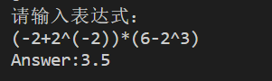

+ 单变量表达式求值。
  + 对于复杂单变量表达式，可以较好实现**正负数**的代入求值。
  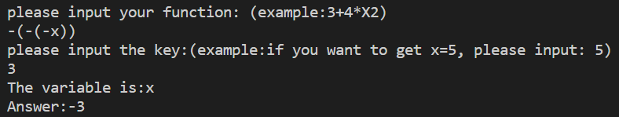
  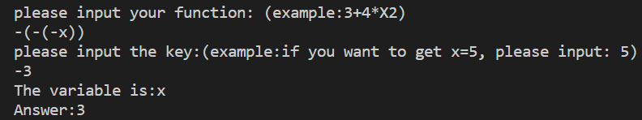
  + 复杂变量的正确识别和计算，如`-3 + 4 * _x2y +6`。
  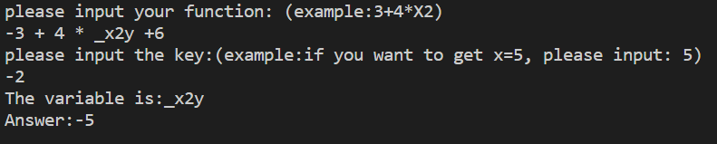
+ 单变量函数求值。
  + 定义f(x),g(x)
  + 计算f(3),g(1)，输出正确结果
  + 计算为定义的h(1)，抛出未定义错误
    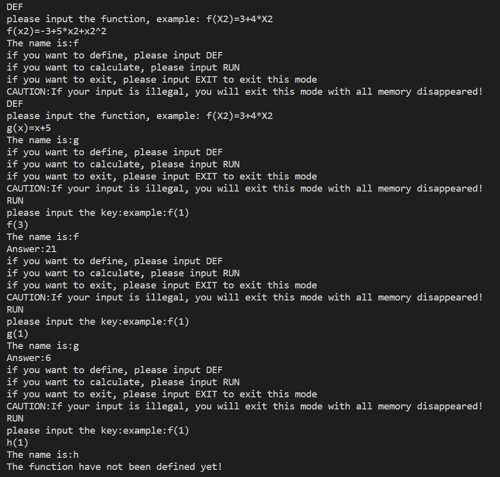
  
+ 一元多项式的加、减、乘计算，**输出可以省略系数为零的项**。
  + 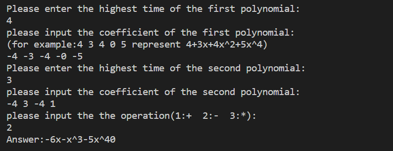
  
+ 一元多项式的积分和求导计算，**输出可以省略系数为零的项**。
   + 微分
     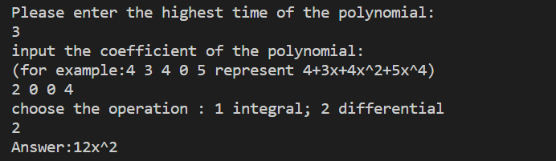
   + 积分 
     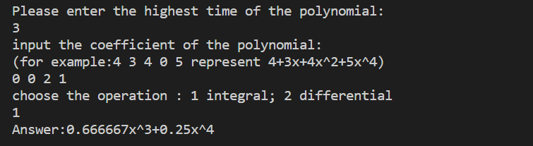
  
+ 矩阵运算。
  + 加减
  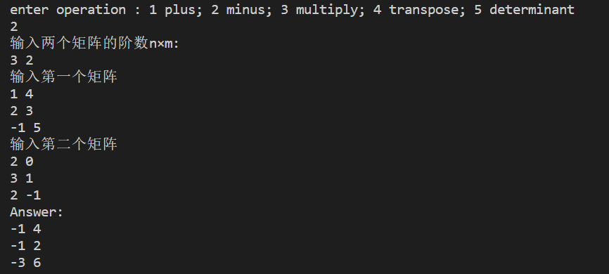
  + 乘
  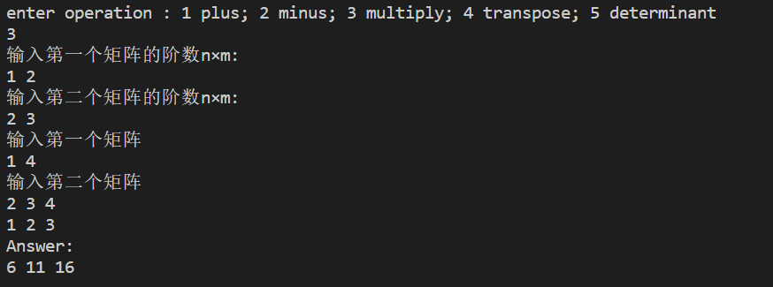
  + 转置
  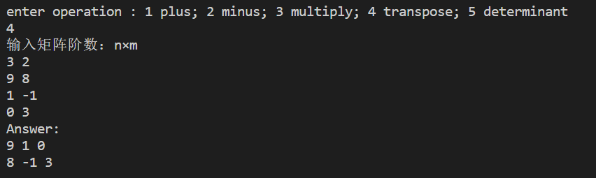
  + 行列式
  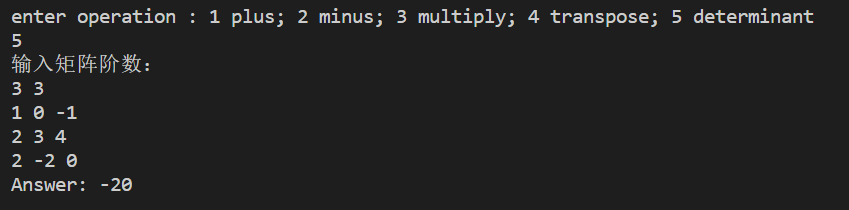

### 总结与体会
+ 通过完成本次计算器大作业，我对一个小项目结构的整理有了更深刻的理解。如函数模块化、接口模板化等等，这样可以增大代码的重用性，可以减少代码出错的可能性和减少调错过程中所带来的的不必要的麻烦。
+ 对边界条件的考虑要完备，这也是非常重要的程序设计思维。如特殊但符合规则的输入、0、负数、数组边界等等，否则容易在意想不到的地方得到意想不到的错误输出或者程序崩溃。
+ 对错误输入的判别，增强程序的鲁棒性和提升程序的安全性。在后期完善程序过程中，我发现识别程序非法输入需要考虑非常多的情况，很多时候要对一些特殊情况进行特判，无法模板化判别，这对程序员的思考完备性也是一种考察。