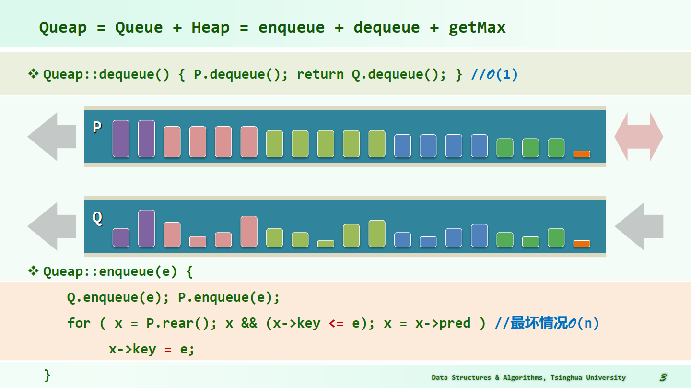
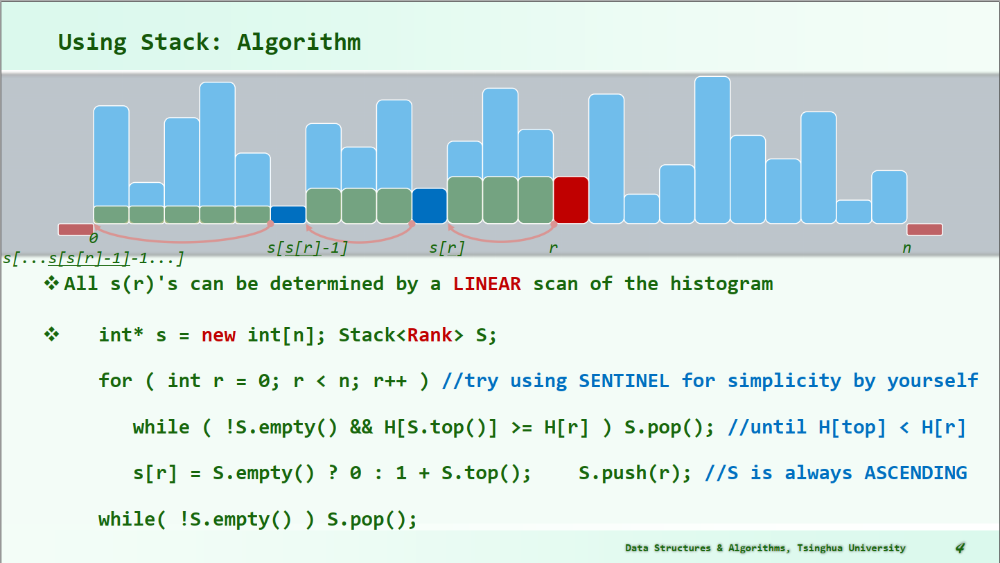

# 摊还分析
###### 李俊霖 2021201709 
#### Queap的enqueue()操作的三种摊还分析
##### 算法如图
 
+ 聚合分析(the aggregate method)
+ 核算分析(the accounting method)
+ 势能分析(the potential method)

#### 直方图内最大矩阵操作的三种摊还分析
 ##### 算法如图
 
+ 聚合分析(the aggregate method)
+ 核算分析(the accounting method)
+ 势能分析(the potential method)
